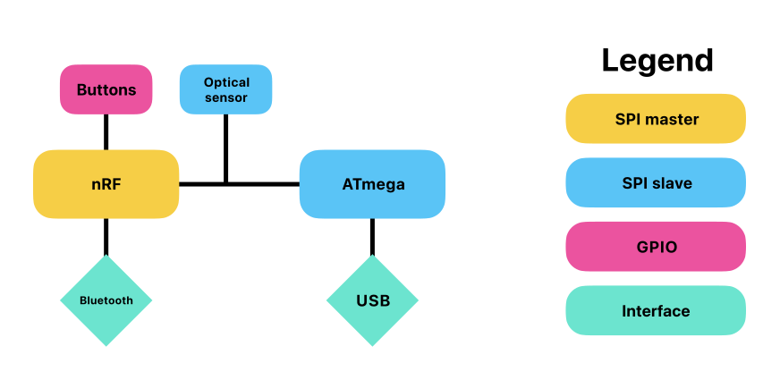

# My mouse

This repository contains firmware for my custom-built wireless mouse. It offers both wireless (Bluetooth)
and wired (via USB-C port) connection using standard HID protocol, and works with pretty much any host device.

## Hardware

    

The mouse hardware is built around [nRF52832][nRF] SoC, with [ATmega8U2][ATmega] acting as a USB bridge
for optional wired connection. The mouse is powered by a rechargeable battery.

## Software

The nRF runs a [Zephyr OS][zephyr] application responsible for collecting input data from buttons and scroll wheel,
Bluetooth communication and system management. Its source code can be found in [app-nrf](app-nrf) directory.

The ATmega implements a backup USB communication (which replaces Bluetooth when connected to host) with
[LUFA][lufa] library. The USB connection can also be used to flash application image on ATmega (using custom
bootloader) or on nRF (to be implemented). The source code can be found in [app-avr](app-avr) directory.

[nRF]: https://www.nordicsemi.com/Products/nRF52832
[ATmega]: https://www.microchip.com/en-us/product/ATmega8U2
[zephyr]: https://www.zephyrproject.org/
